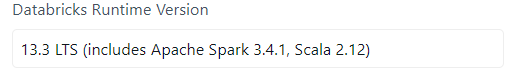

# Using Databricks notebooks inside VSCode

1. Install [Databricks extension](https://marketplace.visualstudio.com/items?itemName=databricks.databricks) from the VSCode marketplace.

2. Create a dedicated environment for local development. 

3. Install `databricks-connect`: The version has to match the runtime version in Databricks!



In this case:

```bash
pip install databricks-connect==13.3.*
```

4. Install `pyspark` in the correct version, according to the runtime again *(in my case 3.4.1)*.

I recommend using conda for installing pyspark as there are dependencies outside the pure python package, which can be installed easily with conda.

5. Install every other dependency that you have on your cluster, and also the jupyter kernel to be able to run code in the notebook.

6. At the beginning of the notebook, add these lines *(I suggest to create user snippets)*:

```python
from databricks.connect import DatabricksSession
import warnings

warnings.simplefilter(
    action="ignore", category=FutureWarning
)  # Remove futurewarnings from pandas
spark = DatabricksSession.builder.getOrCreate()
```

and you are good to go.

Some additional informations:

* Calling a dataframe in this notebook will have the same effect as calling `dataframe.show()` in the Databricks IDE, instead of just printing columns, so be careful, and replace by `dataframe.printSchema()` if needed.

* `dataframe.toPandas()` method repatriates the data on your local machine.

* Everything else from pure spark operations are executed locally.

# Downloading a delta table locally

```python
# Standard Library
import os

# Third-party
import s3fs

from dotenv import load_dotenv

# Application
from databricks import sql

"""WARNING: Make sure to write single partition parquet (pyspark.DataFrame.repartition(1)).write..."""
load_dotenv()
databricks_creds = {
    "server_hostname": os.environ["DATABRICKS_HOSTNAME"],
    "http_path": os.environ["DATABRICKS_HTTP_PATH"],
    "access_token": os.environ["DATABRICKS_ACCESS_TOKEN"],
}

s3 = s3fs.S3FileSystem()
connection = sql.connect(**databricks_creds)
cursor = connection.cursor()

table = "..."

cursor.execute(f"DESCRIBE EXTENDED {table}")
result = cursor.fetchall()
cursor.close()
connection.close()

s3_location = [r.data_type for r in result if r.col_name == "Location"][0]
print(f"{s3_location=}")

files = [f for f in s3.ls(s3_location) if f.endswith(".parquet")]

# Single partition file
s3.download(rpath=f"s3://{files[0]}", lpath="./extract.parquet")
```