# GitHub Project Management

Full project management can be done with:

* **Milestones** — group issues/PRs toward a release or deadline
* **Projects** — kanban/board views to track work across repos
* **Issues** — track bugs, tasks, and feature requests
* **Pull Requests** — propose, review, and merge code changes

# Glossary

## Milestones

A milestone is a container for issues that share a goal (e.g. a version or sprint). Set a due date to track progress toward that goal; GitHub shows completion % as items are closed.

**Milestones are inline in the repo, only repo-scoped.**

They can be found in the "Issues" tab of the repo.

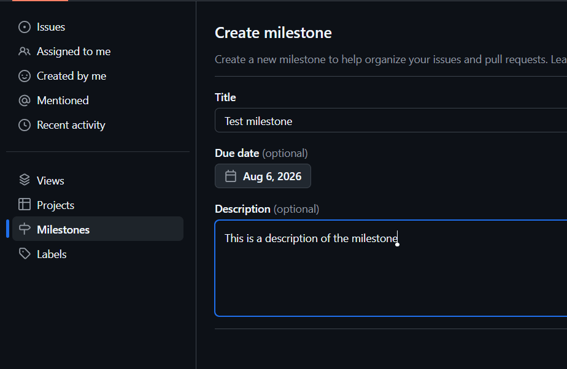

Milestones holds issues, and has a due date *(optional)*.

For this reason, the milestone feature is mainly used for the following purposes:

* Either to measure the progress of a release or sprint
* Either to track the progress of a feature or bug

Keep in mind that milestones are repo-scoped, so they are not visible across repos. Their usage is not suited for cross-repo projects.

## Projects

GitHub Projects are flexible boards (table, board, roadmap) that pull in issues and PRs from one or more repos. Use custom fields, filters, and views to plan and prioritize work without living only in issue lists.

**Projects are cross-repo.**

They can be used as kanban board, roadmap, or table.

They have integrated workflow management, so you can create a workflow to move issues from one column to another, for example when an issue is created, assigned, or closed. This makes the project management more efficient, and more focused on the creation of the issues.

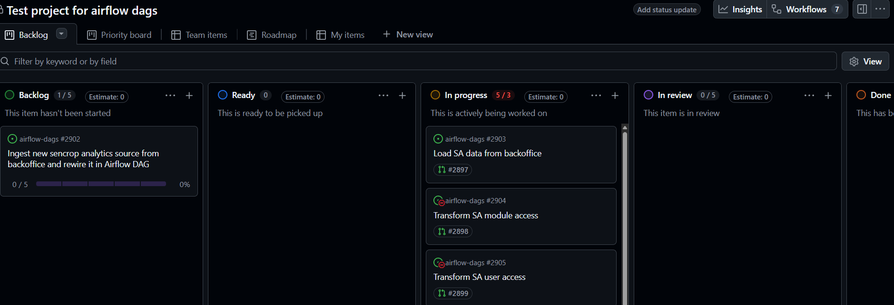

## Issues

Issues are the unit of work: bugs, tasks, or ideas. Label, assign, and link them to milestones/projects. Close when done; reference them from commits and PRs (`Fixes #123`).

**Issues are inline in the repo.** However, they can be linked to issues in other repos.

## Pull Requests

PRs propose merging a branch into another. They carry review, CI checks, and discussion. Link to issues they close; merge when approved and green.

**PRs are inline in the repo.**

# Actual use case

Let's say you are working on a monorepo project. I will take the example of this knowledge documentation project.

I have a deadline to publish the documentation for the next version of the product. Let's say it's in 2 weeks.

For this next release, I need to make a documentation for:

* Github project management
* Data visualization in plotly

The steps are the following:

## 0. Create a project to track the work

This step is to be done only once. It is the main entrypoint to track works, even across different repos.

The creation of a "project" don't require to be redone each time you have a new work to do. It is more of a setup for a tracking dashboard system.

There are a lot of "Project" templates available, and you can also create your own. As they are starting templates, you won't miss anything if you select the wrong one, because you can always edit the project later and create the views you need.

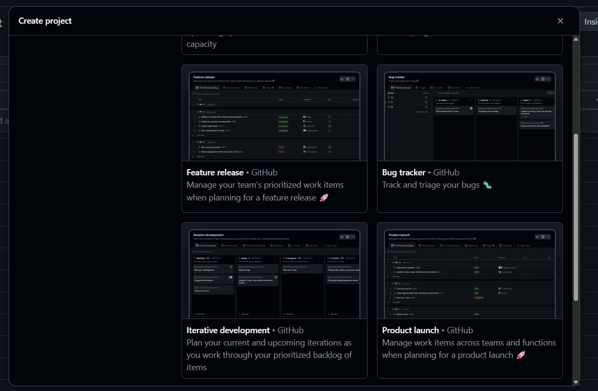

## 1. Create a milestone for the release

Define the milestone, and add the deadline.

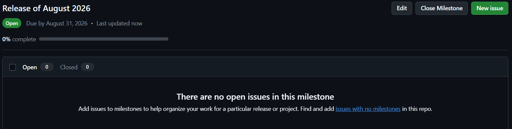

From there, you have an empty milestone.

You have to create the issues.

## 2. Create the issues

There are 2 main topics here:

* Github project management
* Data visualization in plotly

So, we are going to create 2 issues, one for each topic.

Those issues will be parent issues. We will use them to create the sub-issues related to each topic.

You can set start/end dates, team, iteration, quarter etc.

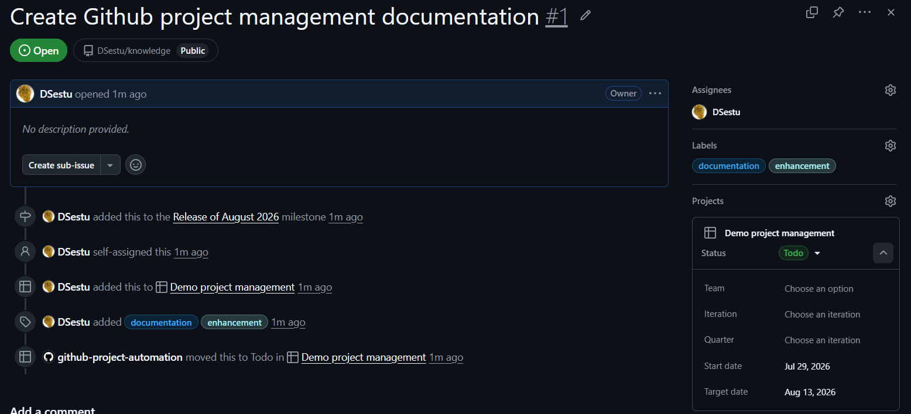

## 3. Create the sub-issues

Let's say that, for the "Github project management" topic, we need to create the following sub-issues:

* Document the usage of milestones
* Document the usage of projects
* Document the usage of issues
* Document the usage of pull requests

For this, we will be able to create sub-issues from the parent issue interface (or add an already existing issue as a sub-issue).

Each one of those sub-issues can have its own assignee, due date, and other metadata.

The sub-issue system can be nested, so you can create sub-sub-issues, and so on.

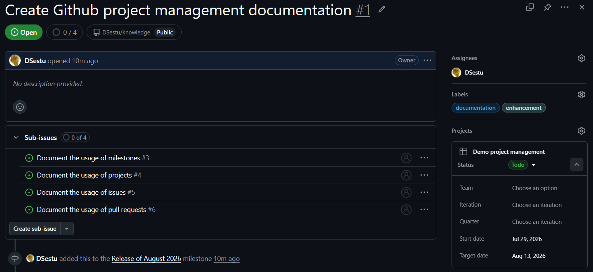

Issues will show up in the basic "issues" tab of the repo.

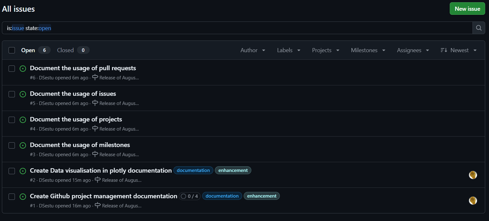

They will also show up in the project dashboard, in multiple ways:

* Gantt style view

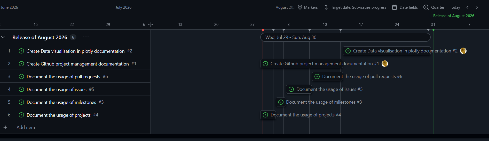

* Kanban style view:

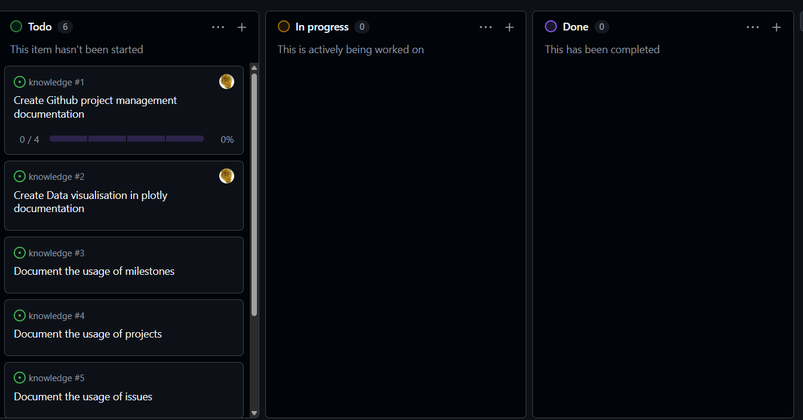

* But also, in a structured table view:

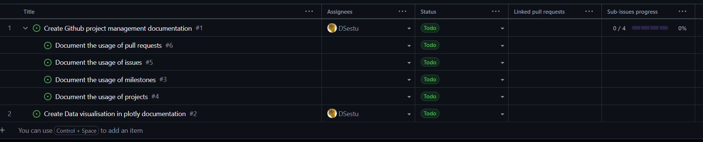

## 4. Define issue dependencies

Some features can need the pre-existence of other features. Github issues, an issue can be blocked by one or more other issues, and vice versa.

For example here, I defined that the documentation of pull requests is blocked by the documentation of issues. I also defined that this issue is blocking the documentation of projects.

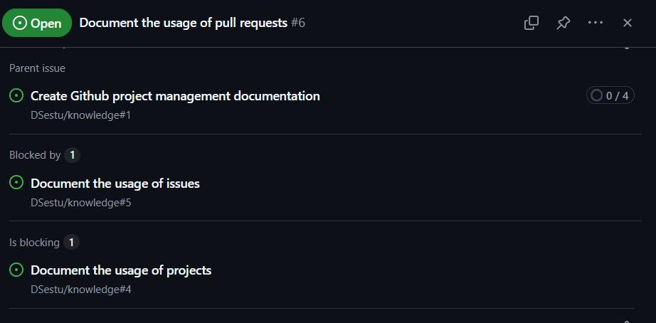

Having a blocked issue will display a blocked icon and tag next to the issue.

The "blocked" status will be removed once each of the blocking issue is completed/closed.

## 5. Start working on the issues

> **I strongly recommend to have the `gh` CLI installed, together with the gh-stack plugin.**

Issue statuses can be modified by hand. However, there are default integrated workflows in projects.

Issues can be linked to pull requests. The state of an issue can be linked to the existence/status of one or more pull requests.

A very useful way of tracking progress is the following:

At a parent issue level, you can have the following statuses:

* A parent issue is in "To do" status if all of its sub-issues are in "To do" status.
* A parent issue is in "In progress" status if at least one of its sub-issues is in "In progress" status.
* A parent issue is in "Done" status if all of its sub-issues are in "Done" status.

At issue level, you can have the following statuses:

* If an issue has no associated pull request, it is in a "Todo" status.
* If an issue has an associated pull request, it is in a "In progress" status.
* If all the associated pull requests are merged, it is in a "Done" status, hence, closing the issue, and unblocking the other blocked issues.

## 6. Creating a branch from an issue

You can create a branch from an issue by using the online interface from the right panel.

You can also create a branch from an issue by using the `gh` CLI.

```bash
gh issue list
```

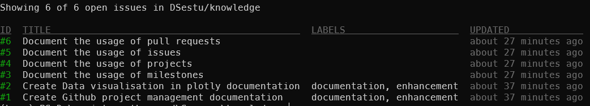

Create the branch, but you will have to checkout it manually.

```bash
gh issue develop <issue-number>
git checkout <branch-name>
```

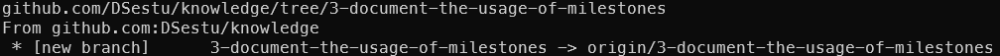

This will create a branch from the issue, and push it to the remote repository.

...commits later...

Lets create the pull request from the branch.

```bash
gh pr create
```

This will automatically link the created PR to the issue. However, it won't automatically add the PR to the project or to the milestone.

Adding the PR to the project will have the effect of displaying it in the "Project" interface. For project management, I don't recommend to do it, and only stick to display issues in the project for clarity.

Having the PR linked to the issue will automatically do these things:

* Update the issue status to "In progress"
* Display the PR in the project

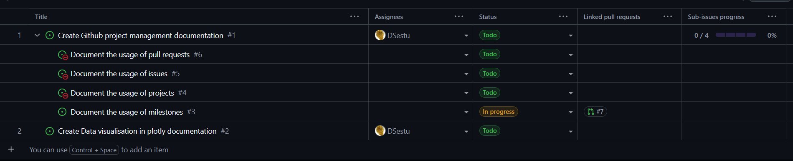

## 6. Merging the pull request

Merging the PR will automatically lead to this cascade of events:

* Update the issue status to "Done"
* Unblock the other blocked issues
* Update the parent issue progress
* Update the milestone progress

For the example, I merge the PR.

Now, my project looks like this:

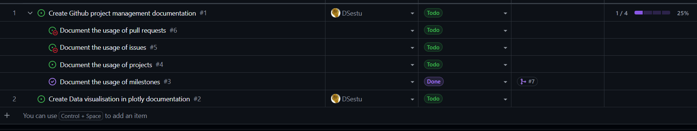

The parent issue looks like this:

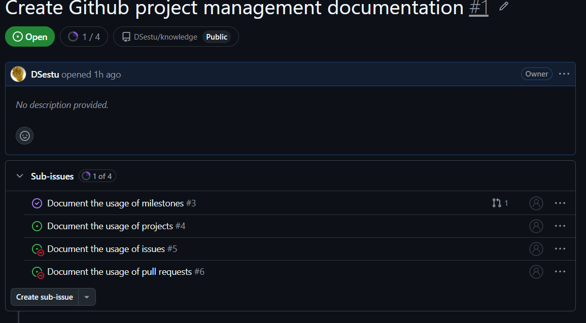

And the milestone made progress too:

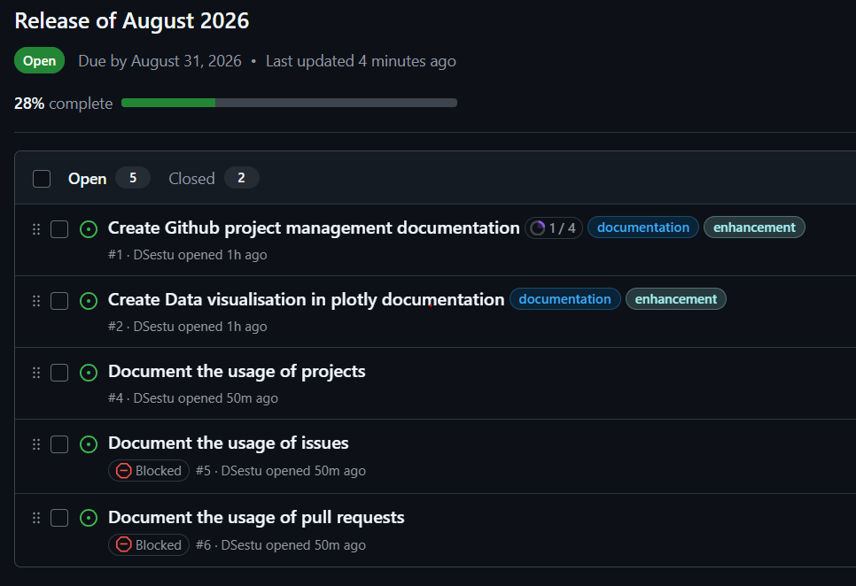

## 7. PR stacking

PR stacking can work well in par with this kind of project management, if we are working at a mono-repo level.

PR stacking can be, of course, used inside a single issue *(issues can be linked to multiple PRs)*.

PR stacking can also be used to work on multiple issues at the same time if they have a linear dependency.

For example, I want to work on an ingestion pipeline for a new data source.

Lets say I have 4 steps:

* Create the data source schema
* Create the data source ingestion pipeline
* Create the data transformation pipeline
* Create the data push pipeline

I will create a parent issue "Ingest and push new data source".

Then, i will create 4 sub-issues, one for each step.

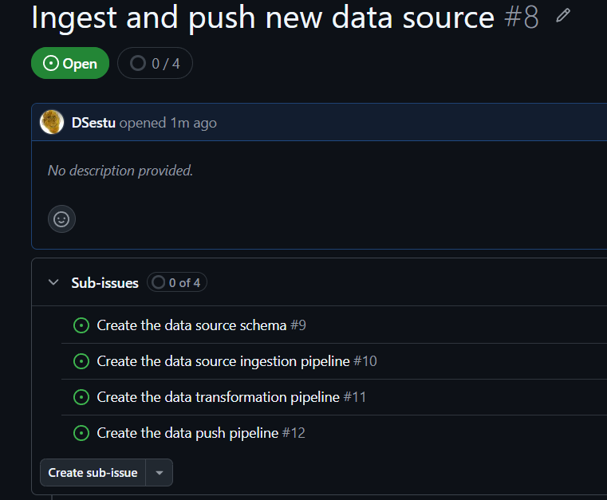

The issue dependencies will be the following:

schema -> ingestion -> transformation -> push

So, I create the branches for each issue.

```bash
gh issue list
```

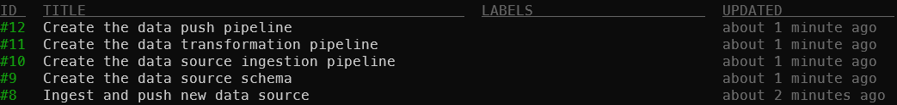

Then, I create each branch

```bash
gh issue develop 9
gh issue develop 10
gh issue develop 11
gh issue develop 12
```

Then, I use the `gh stack` CLI to create the stack.

```bash
 gh stack init 9-create-the-data-source-schema 10-create-the-data-source-ingestion-pipeline 11-create-the-data-transformation-pipeline 12-create-the-data-push-pipeline
```

Now I have a working stack of branches.

```bash
gh stack view
```

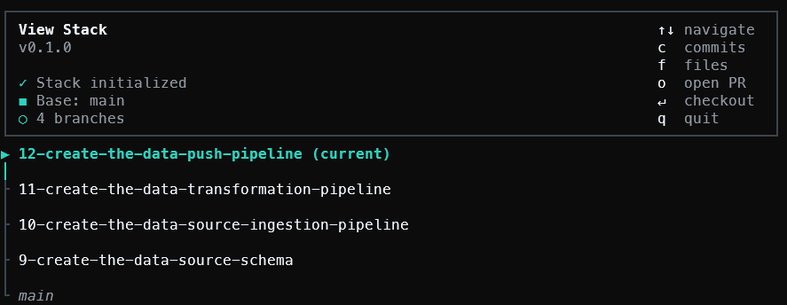

The benefit of PR stacking is that you can cascade rebase your branches, batch submit PR's, and batch push them.

So, let's say that you worked on each of the branches, but you missed something in the data source schema.

Using the stack view command, you can easily checkout to this branch, then run the `gh stack sync` to cascade rebase your branches the top branches.

One useful feature is that you can also add new layers of in the stack, bottom, top or in between.

So, if for example, you find during development that there is a bug that needs to be fixed before even implementing the data source schema, you can add a new layer in the stack, at the very bottom. Then, bugfix on this branch, and cascade rebase your branches to the top.

```bash
gh stack modify
```

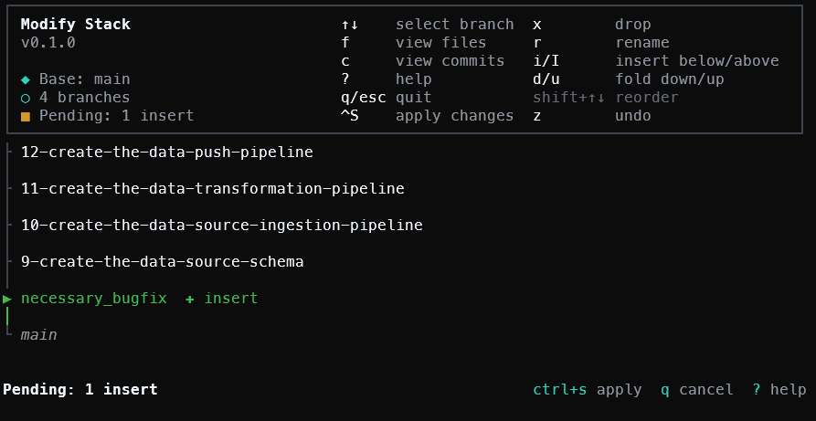

a
