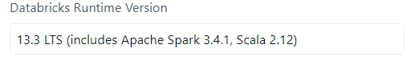

# Databricks

## Using Databricks notebooks inside VSCode

1. Install [Databricks extension](https://marketplace.visualstudio.com/items?itemName=databricks.databricks) from the VSCode marketplace.

2. Create a dedicated environment for local development. 

3. Install `databricks-connect`: The version has to match the runtime version in Databricks!



In this case:

```bash
pip install databricks-connect==13.3.*
```

4. Install `pyspark` in the correct version, according to the runtime again *(in my case 3.4.1)*.

I recommend using conda for installing pyspark as there are dependencies outside the pure python package, which can be installed easily with conda.

5. Install every other dependency that you have on your cluster, and also the jupyter kernel to be able to run code in the notebook.

6. At the beginning of the notebook, add these lines *(I suggest to create user snippets)*:

```python
from databricks.connect import DatabricksSession
import warnings

warnings.simplefilter(
    action="ignore", category=FutureWarning
)  # Remove futurewarnings from pandas
spark = DatabricksSession.builder.getOrCreate()
```

and you are good to go.

Some additional informations:

* Calling a dataframe in this notebook will have the same effect as calling `dataframe.show()` in the Databricks IDE, instead of just printing columns, so be careful, and replace by `dataframe.printSchema()` if needed.

* `dataframe.toPandas()` method repatriates the data on your local machine.

* Everything else from pure spark operations are executed locally.

## Importing locally data from databricks efficiently

The idea is to create a single partitioned table and then download it from s3.

```python
import s3fs

s3 = S3FileSystem()
table_location = "(...)"

# Drop the table
spark.sql(f"DROP TABLE IF EXISTS {table_location}")
# Create the single partition table
(
    spark_dataframe
    # Repartition so there is only one parquet file
    .repartition(1)
    .write.mode("overwrite")
    .saveAsTable(table_location)
)
# Get the S3 location of the table
s3_location = spark.sql(f"DESCRIBE DETAIL {table_location}").toPandas().iloc[0]["location"]
print(f"{s3_location=}")

# Get the parquet file name from the s3 path
s3.ls(s3_location)
```
