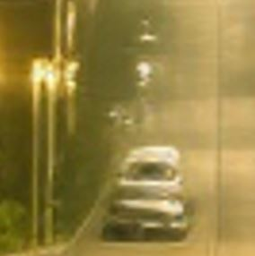
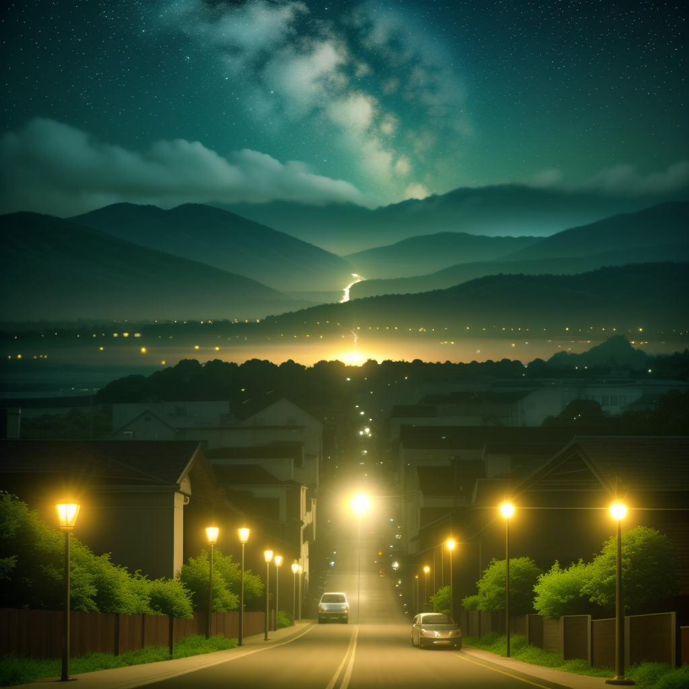
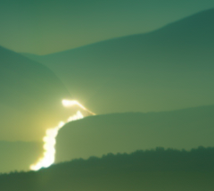
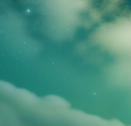
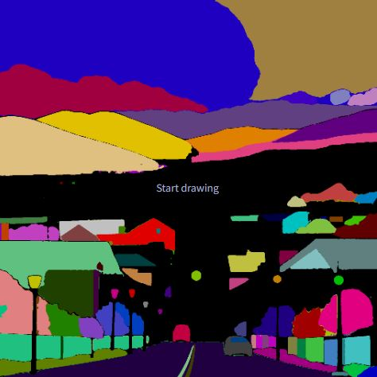

# Upscaling

Great upscaling with SD.

Takes advantage of the generative property of the model.

One big benefit of this method: Experiment fast in txt2img generation by mass generation, and then postprocess/add details/enhance/upscale in img2img when you have a good starting point.

# Prequisites:


## Imperatives

* [Controlnet](https://github.com/Mikubill/sd-webui-controlnet)

Controlnet constrains the generation in various ways. Here we will use Controlnet tile in conjunction with the next prequisite.

* (Contronet tile model)[https://huggingface.co/lllyasviel/control_v11f1e_sd15_tile/tree/main]
  
Rename the `.bin` model and place it in `models/ControlNet`

* [Ultimate Upscale for SD](https://github.com/Coyote-A/ultimate-upscale-for-automatic1111)

For this tool, enable the batch processing mode, this will make batch processing possible with this script:

```bash
cd extensions/ultimate-upscale-for-automatic1111
git pull
git checkout batch-processing
```

* [4x Ultrasharp Upscaler](https://civitai.com/models/116225/4x-ultrasharp)

## Optional

**Optional (and recommended)**, makes the generation much faster (at the cost of quality, but this is very okay for this use case):

* [The LCM sampler](https://github.com/light-and-ray/sd-webui-lcm-sampler)
* [The LCM LoRA](https://civitai.com/models/195519/lcm-lora-weights-stable-diffusion-acceleration-module)


# Methodology

Let's consider this base generated image, which is 512x512 (the base resolution).


Here are some key details:


|Distorted car  |Blurry mountains/lights  |Stars  |
|---------|---------|---------|
|     |         |         |


## Parameters *(baseline)*

* You can use additional prompt in order to constraint/guide the generation process. And/or interrogate CLIP in order to get a prompt that seems to match your input image.

* Use preferably an impainting-focused model.

* Use a very low denoising strength (0.1-0.2)

* If you want to use LCM (makes generation faster):

  * Add the LCM lora in the prompt (the prompt may differ).

  * Use lower number of sampling steps, or this will "polish" the result (8-15 sampling steps). If you feel that there is not enough generation freedom in the result, increase the number of steps.

  * Put the CFG scale at minimum (1).

* Put an high batch size (easier if you use LCM), typically 8.

* Use contronet tile model:

    * type: tile/blur

    * preprocessor: tile_resample

    * model: whatever your controlnet tile model is named.


* In scripts use: Ultimate SD Upscale:

    * Target size type: scale from image size

    * (recommended) Scale: 2

    * Upscaler: 4xUltrasharp

> If you want to upscale x4, I recommend to make 2 times an upscale of 2. This will mitigate a bit the model to go crazy in the feature creation and is more a top-down approach.

For the 2nd upscale, I recommend putting a lower denoising strenght otherwise you will start to loose details that you gain in the first upscaling, and get more aberrations.

The denoising strength and the number of steps are the 2 sensitive parameters that you need to play with to get the optimal result.


# Result

Here the result with said parameters *(and LCM)*:

* Upscaled 1 time x2:



* Preceding result upscaled again x2:


As you can see, the generative property of diffusion models are a very great way to generate new details in the upscaling workflow:

|Car  |Mountains  |Stars  |
|---------|---------|---------|
|     |         |         |


## Additional notes

Some details might not satisfy you in the upscaled image.

You can still inpaint part of the image with the "only masked content" in order to avoid dealing with large images.

For example the car was changed here to a BMW:


## Large scale impainting

There can exist cases when you want to impaint large areas in the images. In this case, you can't affort to impaint natively because the resolution would be too high for your GPU.

However you can use an analog tile generation method for impainting.

Unfortunately, this is not possible with the previously mentioned script, which is simply not compatible with the impainting feature.

You have to use an alternative method:

Need:

* [Impaint anything](https://github.com/Uminosachi/sd-webui-inpaint-anything)

This use segment anything model (SAM) in order to create masks.

* [Multidiffusion Upscaler](https://github.com/pkuliyi2015/multidiffusion-upscaler-for-automatic1111)

Alternative to the tile Script + controlnet, performs well in Img2Img tasks.


### Methodology

* Use the impaint anything tab to create mask:



* Click on regions you want to impaint

* Create mask

* Go into the img2img impaint with the mask

* Enable tiled diffusion & tiled vae

* Disable controlnet tile

* Disable Ultimate SD Upscaler

* Everything else should be the same methodology

Here the result by impainting stars:

