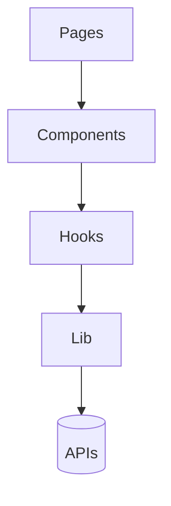

## High-Level Architecture

- UI: React components (dumb/presentational vs. container/page components)
- State: local component state + simple context when needed
- Data: fetch from APIs (if any) via small `lib/api` functions

## Suggested Conventions

- Components live in `src/components/` with subfolders (e.g. `ui`, `layout`)
- Pages in `src/pages/` (if using a router, map routes here)
- Reusable hooks in `src/hooks/`
- Cross-cutting utilities in `src/lib/`

## Routing

- For SPAs: `react-router-dom`
- Keep routes and code-splitting simple; lazy-load heavy pages

## State Management

- Start with React state and context; add Zustand/Jotai only when necessary
- Avoid prematurely introducing global state

## API Layer

- Create small typed fetchers in `src/lib/api` with Zod validation if needed
- Handle errors explicitly; return typed results
